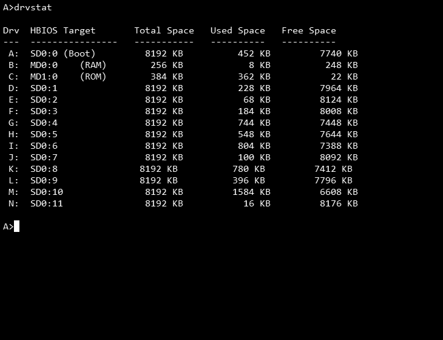

# Turbo Pascal 3 (RomWBW/HBIOS)

**DRVSTAT.PAS** — reports total/used/free space for RomWBW drives. For each drive it calls HBIOS via `Bdos`/`BdosHL` to select the disk, fetch the Disk Parameter Block (DPB) and Allocation Vector (ALV) addresses directly out of memory, then reads block size and total block count from the DPB and counts zero bits in the ALV bitmap to determine free space. Labels the boot/RAM/ROM drives by name (`SD0:0 (Boot)`, `MD0:0 (RAM)`, `MD1:0 (ROM)`) and everything else as `SD0:n`.

**Update 1 (superseded by Update 2 below) — attempted dynamic drive detection.** Investigation (with real boot-log evidence) confirmed the original hardcoded `if Drive < 14` cutoff wasn't a RomWBW/CBIOS architectural limit — `ASSIGN` works identically at boot or run manually later, no timing sensitivity. The real reason O:/P: were unreachable is simply that this machine's SD card was only ever formatted with 12 CP/M slices — nothing to assign those letters *to*. That part of the diagnosis held up. The attempted fix didn't: it assumed CP/M BDOS function 14 (Select Disk) returns 0 cleanly for an unassigned drive, the same way the underlying BIOS-level `SELDSK` routine is documented to. That's true at the BIOS layer, but **BDOS wraps Select Disk with its own built-in error trap** that fires immediately on an invalid drive — printing `Bdos Err On x: Select` and aborting execution — *before* the calling program ever gets control back to check a return value. Confirmed on real hardware: this crashed at drive O:, recoverable only via Ctrl-C.

**Update 2 — reverted to a manual, known-safe cutoff.** Since checking Select Disk's return value can't work as a safety mechanism for this function, the drive-count limit is back to being a hardcoded constant (`MAX_CONFIGURED_DRIVE`, currently `13` — i.e. drives A: through N:) that must be edited by hand to match your own system's actual configured drive count (count the letters in your own `Configuring Drives...` boot banner). The Update 1 improvements that *were* safe — named constants (`BOOT_DRIVE`/`RAM_DRIVE`/`ROM_DRIVE`/`SD_SLICE_OFFSET`) replacing scattered hardcoded checks in the print logic — are kept, since those never touched the actual crash risk.

Honestly, the BDOS/CBIOS interaction that causes the crash isn't something I fully understand at the level of "here's exactly what's happening and why" — just that it demonstrably happens, confirmed once on real hardware. There's probably a genuinely safe way to detect an unassigned drive without hitting BDOS's error trap, but rather than guess again and risk another crash, this reverts to the boring-but-known-safe manual cutoff until someone (possibly future me) actually understands the mechanism well enough to fix it properly.

## Future ideas

- **Column alignment** — the current output isn't consistently padded/aligned across all rows; worth tightening up.
- **Stretch goals** — box-drawing borders around the table, and color-coding entries by free-space percentage (e.g. red/yellow/green thresholds).
- **Fully automatic labels** — if a verified HBIOS call for querying the real unit name string behind a drive letter is ever found, the `BOOT_DRIVE`/`RAM_DRIVE`/`ROM_DRIVE` constants could be replaced with genuine auto-detection instead of a manual mapping. Not yet researched.
- **Genuinely safe dynamic drive-count detection** — worth revisiting if there's ever appetite for it, but *not* via Select Disk's return value (proven unsafe above). A next candidate worth trying cautiously: BDOS function 24 (Return Login Vector) returns a bitmap of which drives have been logged into so far this session — checking that *before* ever calling Select Disk might avoid triggering the error trap at all, since every currently-assigned drive is likely already logged in by the time DRVSTAT runs (from ordinary CP/M activity like running commands from that drive). This is unverified and could have its own false-negative edge cases (a validly-assigned-but-never-yet-selected drive reading as unlogged); if pursued, test incrementally rather than trusting it outright.
Not yet implemented.
