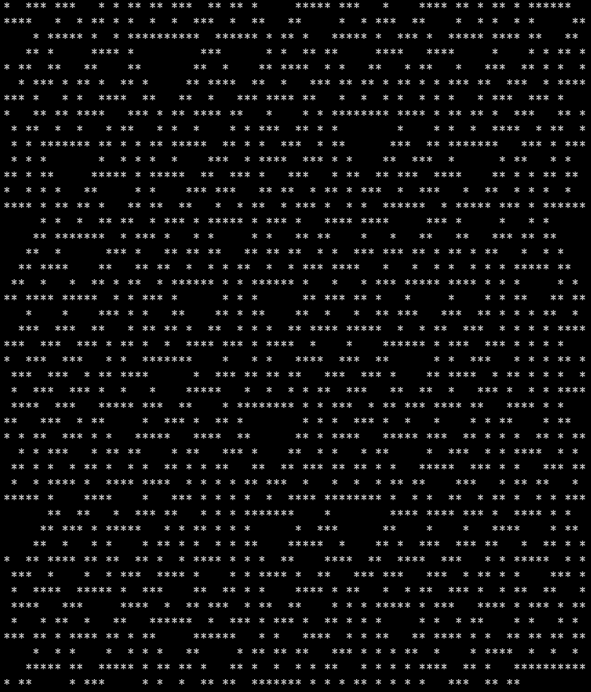
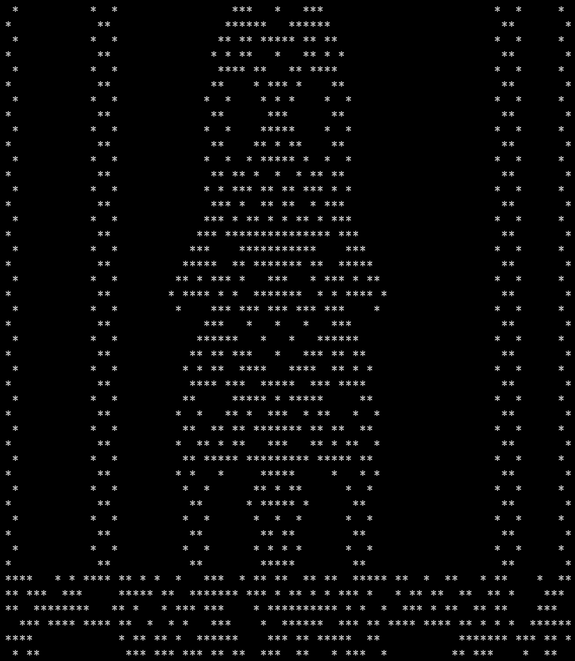
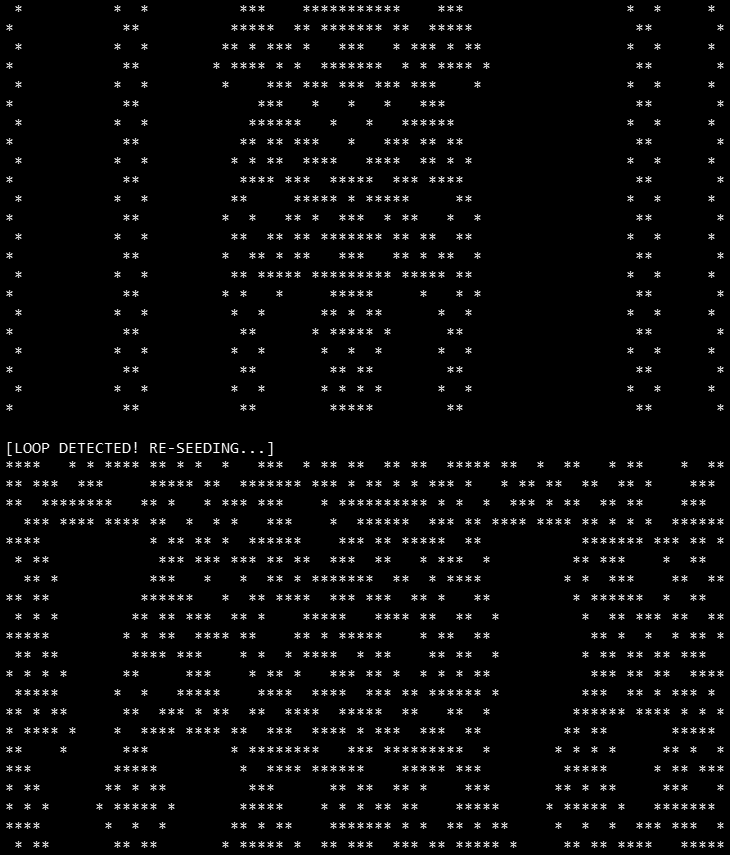

# Game of Life screensavers (CP/M, Aztec-C)

1D cellular-automaton "screensaver" style displays — not the classic 2D Conway's Life (see `../../BASIC-80/LIFE.BAS` for that one).

## Versions

- **LIFE30.C** — Wolfram's **Rule 30** 1D automaton over an 80-cell row (`cell_a[82]` with 1-cell wrap padding): next state = left XOR (current OR right). Re-seeds randomly if a row goes fully dead or fully alive. Uses a simple LFSR (`get_rnd`) seeded at 1234.

  

- **MILLIFE.C** — wider automaton (80 active cells inside an 84-cell buffer with 2-cell wrap padding each side), using Jon Millen's 4-neighbor-sum rule (see below) instead of a Wolfram elementary rule. Adds loop detection: keeps a checksum history of the last 8 generations and re-seeds if a checksum repeats (silently).

  

- **MILLIF2.C** — identical to MILLIFE.C except it prints `[LOOP DETECTED! RE-SEEDING...]` when the loop-detection re-seed triggers, instead of doing it silently.

  

All three exit on any keypress (`kbhit()`/`bdos(11,0)`), same as the Tetris versions.

**MILLIFE**/**MILLIF2** are named in tribute to **Jon Millen**, author of "One-Dimensional Life" in BYTE Magazine, Vol 3 No 12, December 1978 — the five-cell YYXYY neighborhood rule these programs implement. See [jonmillen.com/1dlife](https://jonmillen.com/1dlife).

## Future ideas

- **MILLIF2.C** — consider adding a BEL character (`\a` / `0x07`, or `bdos(2, 7)` for direct console output matching the existing `bdos()` pattern) right before printing `[LOOP DETECTED! RE-SEEDING...]`. Since this runs as a background screensaver, a beep/flash on the one notable event (a loop re-seed) would be a nice, in-character way to draw attention without needing to be watching the screen. Not yet implemented.
