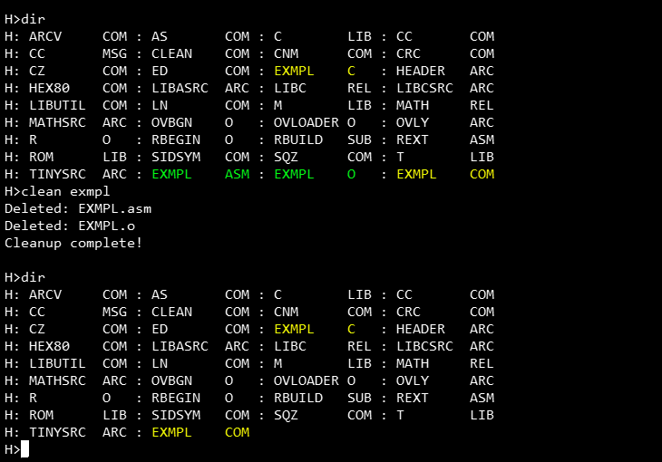
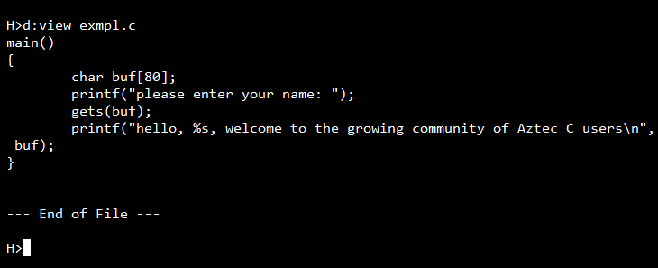
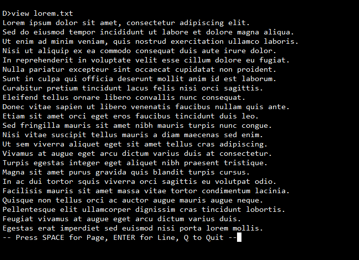

# CP/M utilities (Aztec-C)

- **CLEAN.C** — deletes build artifacts (`<name>.asm`, `<name>.o`, `<name>.bak`) for a given program name. `CLEAN program_name`

  

- **VIEW.C** — a paged file viewer (like `more`/`TYPE`), 23 lines per page, then prompts: SPACE = next page, ENTER = next line, Q = quit. Stops on CP/M EOF marker (Ctrl-Z / 0x1A). `VIEW filename`

  
  
