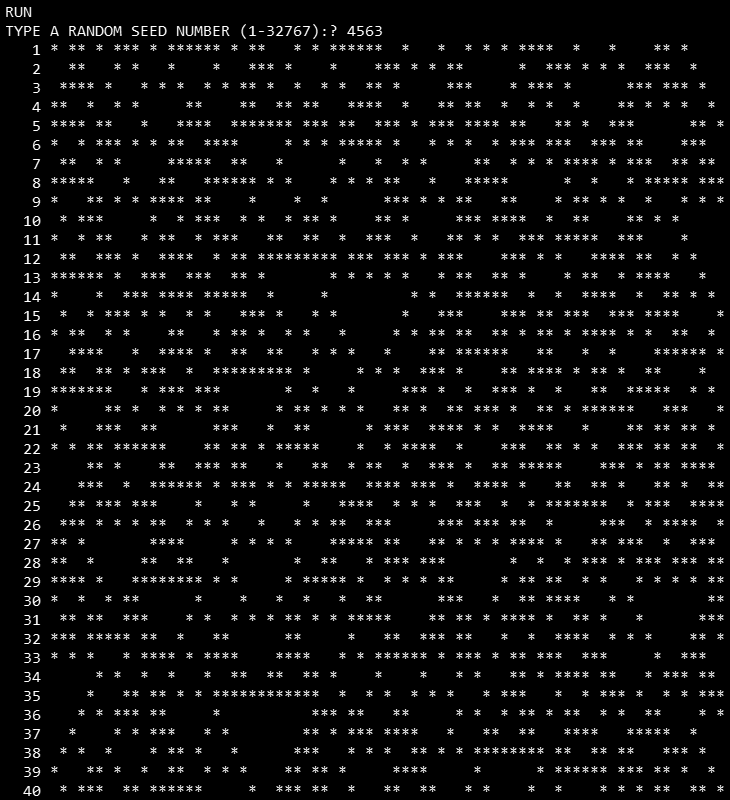
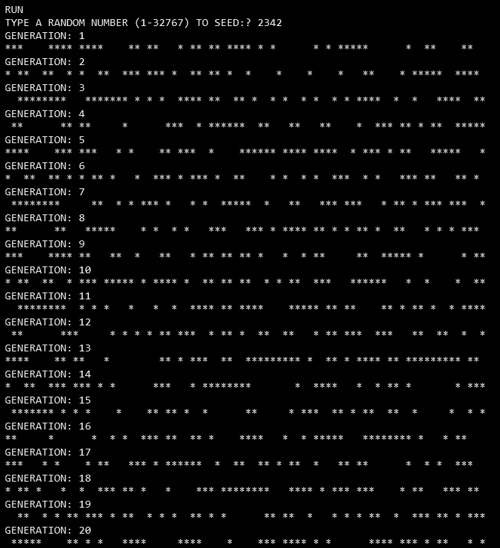
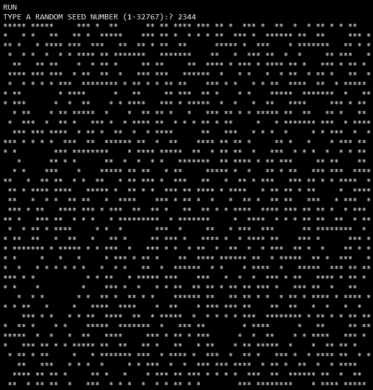
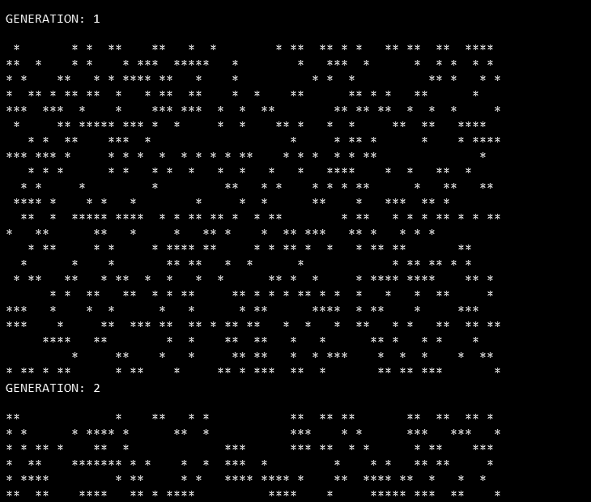

# BASIC-80 (MBASIC, CP/M)

These are plain-text MBASIC listings — not tokenized binaries. MBASIC's `LOAD` auto-detects the format, so a plain-text `.BAS` loads and runs identically to a tokenized one; the only trade-off is a slightly larger file and a hair slower load, in exchange for being directly readable here on GitHub and needing no detokenizer.

## Files

- **1DLIF80.BAS** — "1D LIFE FOR CP/M 80-COLUMNS": 1D cellular automaton (Rule-90-style, XOR of neighbors) across a random-seeded 80-column row.

  

- **1DLIFE.BAS** — "1D RANDOM LIFE FOR BASIC-80 5.21": same rule, labeled with generation count as it runs.

  

- **1DLIFSS.BAS** — "1D LIFE SCREENSAVER - 80 COLUMNS": screensaver variant with a boundary wrap-around and an "anti-death" safeguard that re-randomizes cells if the row goes fully dead or fully alive.

  

- **AUTOLIF.BAS** — "2D RANDOM LIFE FOR MBASIC 5.21": the classic 2D Conway's Life rule (8-neighbor sum, standard birth/survival counts). Prompts for a seed number (1–32767) at startup, then randomly populates a 22x68 grid (~35% alive) from that seed — no hand-drawn starting pattern needed, unlike LIFE.BAS. Re-seeds automatically ("COLONY DIED OUT!") if the whole colony goes extinct. Runs forever, generation counter displayed each cycle. The seed itself isn't stored anywhere by the program (no file write, nothing kept beyond the initial `INPUT`), so if you want to revisit a specific run later, you need to have noted the seed down yourself at the time.

  

  Tried to catch a screenshot of the re-seed ("COLONY DIED OUT!") message with seed **23432** — it ran 485 generations without dying out before being stopped manually, settling into what looked like a stable/oscillating pattern rather than heading toward extinction.

- **LIFE.BAS** — the classic 2D Conway's Game of Life from *Creative Computing, Morristown, NJ*, with user-entered starting patterns and a bounding-box optimization so it only scans the region that's actually populated.

  LIFE.BAS is from *BASIC Computer Games* (originally *101 BASIC Computer Games*), edited by David H. Ahl. Ahl released the entire book into the public domain in June 2022: https://blog.adafruit.com/2022/06/16/david-ahl-places-all-his-classic-computing-publications-into-the-public-domain/

These are the BASIC-80 counterparts to the C "life" programs in [`../Aztec-C/life/`](../Aztec-C/life/) — same general idea (automaton screensavers), different language/toolchain.
