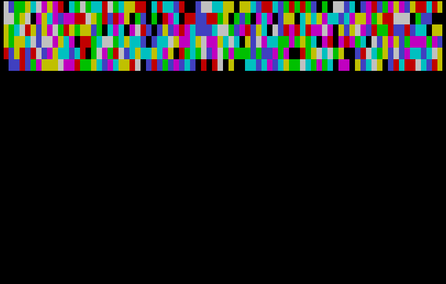

# Hex Digits of π (Turbo Pascal 3, color)

Endless streaming display of π's hexadecimal digits as a color-coded "thermal gradient" (cold blues for low digit values, up through greens/yellows to hot reds and white for high values). Both use the BBP (Bailey–Borwein–Plouffe) spigot formula, which can compute an individual hex digit of π without computing all the digits before it.

- **HEXPI.PAS** — full BBP formula using `Real` (floating point) arithmetic via modular exponentiation, so it can reach arbitrarily deep digit positions. **Known issue:** ESC does eventually exit it cleanly ("Visual stream stopped."), but the delay before it responds can be enormous — the code only checks for a keypress once between each digit, and each digit's computation (`SeriesSum` loops from 0 to the current digit index) takes longer the further in it's gotten, so the interval between checks balloons over time. In practice this means mashing ESC (or anything else) does nothing for a long stretch, then a pile of buffered keystrokes all land at once, echoed at the CP/M prompt, the moment it finally exits. Combined with it already being extremely slow (unusable after ~4 hours), don't expect a quick response — HEXPI2.PAS below responds to ESC promptly.

  

- **HEXPI2.PAS** — a faster variant restricted to strictly native 16-bit integer math throughout, trading away the unbounded digit range for speed. Press ESC to stop.

  
