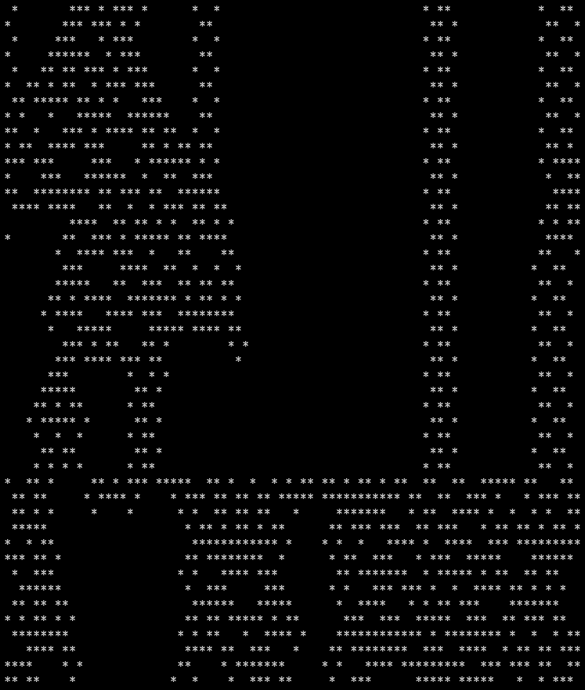

# Game of Life screensaver (Turbo Pascal 3, color)

**MILLIFE.PAS** is a Pascal port of the Aztec-C `MILLIFE.C`/`MILLIF2.C` 1D cellular automaton (see [`../../../Aztec-C/life/`](../../../Aztec-C/life/)) — same 4-neighbor-sum rule and loop detection (an 8-generation checksum history that triggers a re-seed if a checksum repeats), but each live cell also carries a color (an ANSI background color code 41–47) that blends from its neighbors' colors as generations evolve, instead of the plain `*`/space display of the C version. Uses the same LFSR-based `GetRnd` as the C original for its initial seeding.

Named in tribute to **Jon Millen**, author of "One-Dimensional Life" in BYTE Magazine, Vol 3 No 12, December 1978 — the five-cell YYXYY neighborhood rule this program implements. See [jonmillen.com/1dlife](https://jonmillen.com/1dlife).

## HEXLIFE.PAS

A different kind of Life screensaver, born out of watching `AUTOLIF.BAS` (see [`../../BASIC-80/`](../../BASIC-80/)) settle permanently at generation 788 (seed 23432) and just sit there forever afterward, once its identical two phases were confirmed byte-for-byte via diff. This version exists specifically so that doesn't happen.

- **Classic 2D Conway's Life** (8-neighbor sum, same rule as `AUTOLIF.BAS`/`LIFE.BAS`), not Millen's 1D rule — what's borrowed from the 1D life programs is the *technique*, not the rule.
- **Fully toroidal** — wraps all four sides (a "ball" rather than a cylinder or a bounded dead-border grid like `AUTOLIF.BAS` uses).
- **Displayed as hex digits in a fixed-position bordered playing field**, redrawn in place each generation rather than scrolling — each hex digit packs 4 consecutive cells (same MSB-first packing scheme as the hex-encoding change made to `AUTOLIF.BAS`, and the IMSAI Z80/8080 assembly programs elsewhere in this repo).
- **Silent auto-reseed** using the same rolling-checksum technique as `MILLIF2.C` (`checksum := checksum*3 + cell`, compared against a short history) — but silent, no announcement, matching `MILLIFE.C`'s quieter sibling rather than `MILLIF2.C`'s visible one.
- **Grid deliberately smaller than the full terminal:** 40 hex columns × 18 rows (160×18 cells) rather than filling all 80×24. Two full-terminal-width grids would have needed 15,360 bytes — a meaningful fraction of a modest CP/M TPA (`54.0K TPA` seen in this repo's own boot logs). At 160×18 it's 5,760 bytes, a much more comfortable margin. The border and "GENERATION:" label are static chrome drawn once at startup/reseed (never redrawn during normal per-generation steps, since they don't change) — and can be turned off entirely via the `SHOW_CHROME` constant for the borderless look, given modern/virtual terminals don't have the burn-in concern a border traditionally exists to help with.

**Status: confirmed compiling and running on real hardware** — border/label render correctly, hex digits fill the field as expected. One real bug found and fixed along the way: the two string-size type declarations (`THexDigits`, `TNumStr`) were mistakenly placed in the `const` block instead of `type` — Pascal's `const` section can only hold literal values, not type definitions, and that's exactly the kind of thing that throws a `';' expected` compile error. Moved them to `type` where `TGrid` already lives, fixed.

**Pacing confirmed too:** no artificial delay was needed — turns out the natural computational cost (2,880 cells × 8-neighbor lookups, each going through function calls rather than inlined math) runs noticeably slow rather than fast, so there's no blinking-too-quickly risk at all. If anything, speeding it up (rather than slowing it down) would be the more likely future ask — candidate optimizations if that ever comes up: inlining the `WrapCoord`/`NeighborSum` logic directly into `Step` rather than calling out to separate functions for every one of the ~23,000 neighbor lookups per generation, or shrinking the grid further.

**Header expanded to `Seed: NNNNNN  Generation: NNNNNN  Checksum: NNNNNN`.** Switched from Pascal's built-in `Random()`/`Randomize()` (which seeds from an internal clock, giving no visible/enterable number) to the same seedable LFSR `MILLIFE.PAS` already uses (`RandSeed`/`GetRnd`), so a real seed number can be typed in (matching `AUTOLIF.BAS`'s seed-prompt convention) and displayed. Since `GetRnd` only returns a single bit, `GetRndPct` builds a 7-bit value from 7 calls and thresholds it to approximate the ~35% alive-density `AUTOLIF.BAS` uses. The checksum (previously computed silently and discarded each generation) is now cached and displayed too, so the loop-detection mechanism is actually visible instead of a black box — though the *reseed* itself is still silent, no announcement, matching the original design.

**Fixed: ESC didn't reliably quit the program.** Checking `KeyPressed` only once per generation (~2 seconds of uninterrupted computation with essentially zero I/O calls in between) reliably failed to catch ESC — confirmed via isolated diagnostic stubs, even a single clean press with no spamming, no display/output logic involved at all. Ruled out along the way: `KeepRunning` being silently reset elsewhere (checked, wasn't happening), and console output volume interfering with input detection (batched `DrawGrid`'s 720 individual character writes into one string-write per row — genuine perf win on its own, but didn't fix ESC). The actual fix: check `KeyPressed` from *inside* `Step`'s loop, roughly every 200 cells (~14 times per generation) instead of once between generations — confirmed working via a matching isolated test. The exact underlying mechanism isn't fully understood (possibly some UART/BDOS-level behavior on this specific machine that needs reasonably frequent polling to catch an incoming byte before it's lost), but the fix itself is confirmed on real hardware, independent of the mystery around *why* it works.

