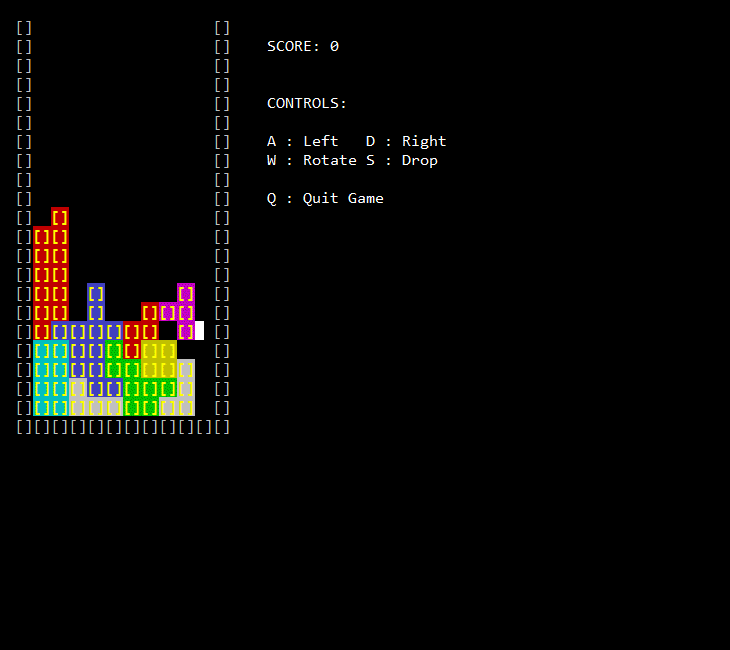
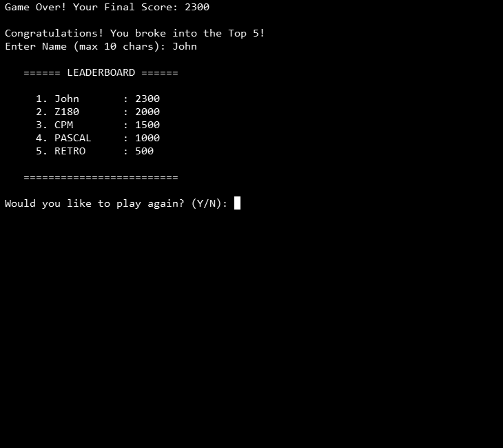
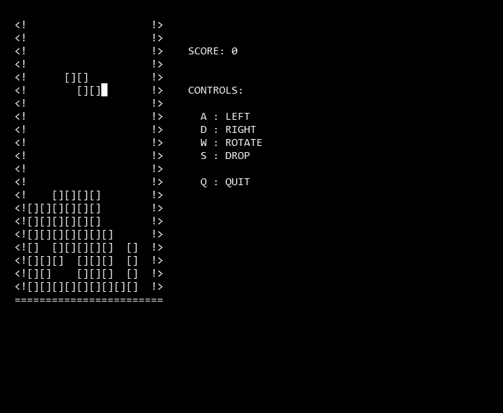
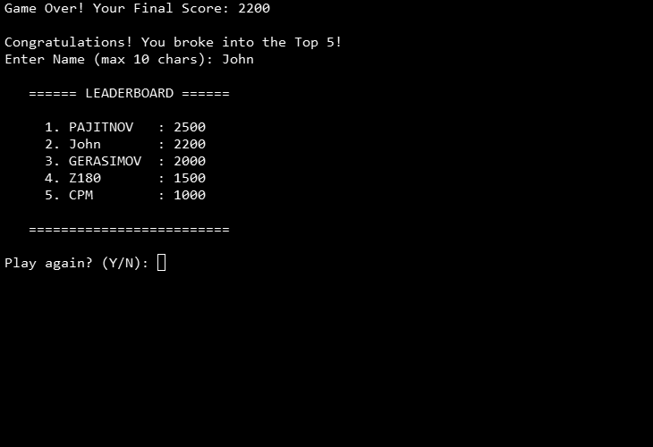
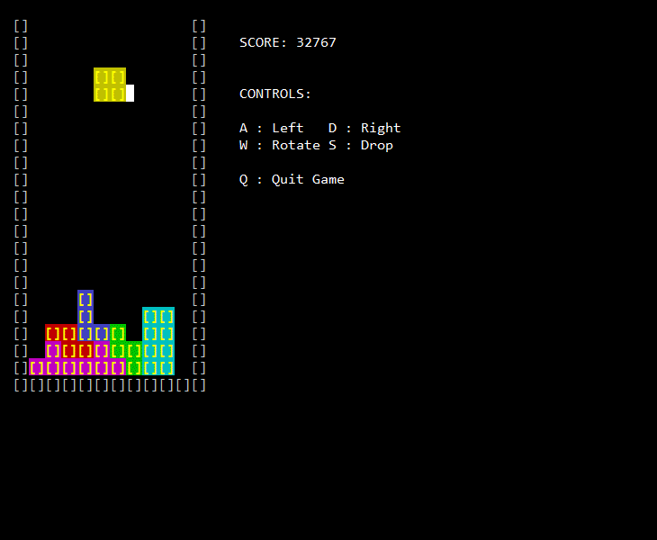
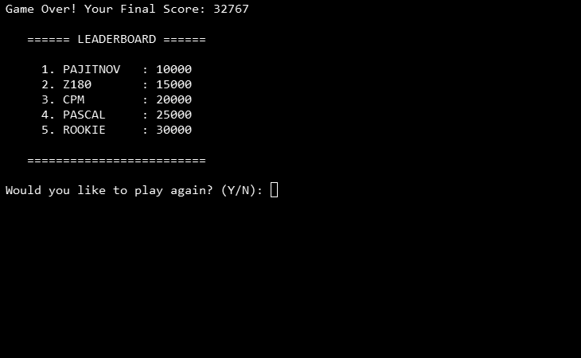

# Tetris (Turbo Pascal 3)

Pascal counterparts to the Aztec-C Tetris versions (see [`../../Aztec-C/tetris/`](../../Aztec-C/tetris/)), same A/D/W/S/Q controls.

- **TETRIS.PAS** — the main version: ANSI color per piece type, a persisted high-score table (`SCORES.DAT`), and a short "lock delay" — a couple of frames of grace after a piece touches down before it locks, tuned for the SC131's clock speed, so a last-moment slide or rotate still counts.

  
  

- **TET84.PAS** — a monochrome reskin styled after the original 1984 Tetris look: wireframe walls (`<!` / `!>` sides, `====` floor), no color, and no lock delay — pieces freeze the instant they land.

  
  

- **TETGOLF.PAS** — "Tetris Golf": built on the same base as TETRIS.PAS, but scoring counts *down* from a starting maximum instead of up from zero — golf-style, lowest final score wins. High scores are kept in a separate file (`GOLF.DAT`) and sorted lowest-first.

  
  

  The original idea was to start the score at the max value an 8-bit Z80 integer could hold and count down from there, tying the "ceiling" to the hardware itself. That reasoning doesn't actually hold — Pascal has ways around the 8-bit limit (larger integer types), so there's no hard hardware ceiling forcing the starting value. The countdown-scoring concept was worth keeping anyway just because it's a fun twist on normal Tetris scoring; the starting value and per-line point deductions are currently placeholders and still need real playtesting to tune for playability (not done yet).

All three use fixed-length `string[n]` types throughout (e.g. `string[10]` for score names) to avoid Turbo Pascal 3's Error 8, which occurs when an unsized `string` is used somewhere that needs a definite length.

## Fixed issues

- **Fixed (Update 2):** the I-piece needed the rotate key pressed twice before anything visibly happened, in all three files. Root cause: `RotatePiece`'s `if Horizontal then / else` branch was building the shape the I-piece **already had**, not the one it should rotate to — so the first press silently toggled the internal `Horizontal` flag with no visual change, and only the second press (now on the opposite branch) actually produced a different shape. Fixed by swapping which branch builds which shape, confirmed working on real hardware (first-press rotation) in all three files: TETRIS.PAS, TET84.PAS, and TETGOLF.PAS.

  Confirming this fix on real hardware surfaced an unrelated but important lesson: pasting source directly into the Turbo Pascal editor over a serial terminal is unreliable — TP3's Auto Indent feature compounds with a paste's own leading whitespace and staggers indentation further right on every line until code gets truncated/corrupted, and this got confused for several other suspected bugs (including what looked like a hard hang) before the actual cause was found. **XMODEM transfer directly to disk, then opening the file normally in the editor, avoids the problem entirely** and is the more reliable way to get patched source onto the machine going forward.
